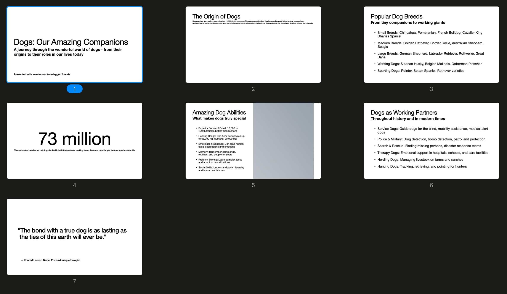

# kslide

`kslide` is a tool for creating and manipulating PowerPoint-style slideshows. It provides both a command-line interface
and an MCP (Model Context Protocol) server for AI integration.

## Getting Started

### Prerequisites

- **Java 17+**
- **Kotlin 1.9.25**
- **Gradle 7.6+**

### Build and Run

1. **Clone the repository:**
   ```bash
   git clone https://github.com/karlll/kslide.git
   cd kslide
   ```

2. **Build the project:**
   ```bash
   ./gradlew build
   ```

3. **Run tests:**
   ```bash
   ./gradlew test
   ```

## Dependencies

### Core Libraries

- **Apache POI 5.4.0**: PowerPoint file manipulation and formatting
- **Flexmark-Java 0.64.8**: CommonMark/Markdown parsing and processing
- **Kotlin Standard Library**: Core Kotlin functionality

### Framework Dependencies

- **Spring Boot 3.5.0**: Application framework and dependency injection
- **Spring Shell 3.4.0**: Interactive command-line interface
- **Spring AI 1.0.0**: MCP server integration for AI clients
- **Jackson Kotlin Module**: JSON serialization/deserialization

### Testing Dependencies

- **JUnit 5**: Testing framework
- **MockK 1.13.10**: Kotlin-specific mocking library

## MCP Server

The MCP server enables AI clients to generate PowerPoint slideshows programmatically.

### Features

- **Template-based slideshow creation** with configurable layouts
- **Markdown support** for rich text formatting
- **Slide content management** with placeholder-based content insertion
- **File export** to PowerPoint (.pptx) format

### Setup

1. **Build the MCP server:**
   ```bash
   ./gradlew :mcp:bootJar
   ```

2. **Configure Claude Desktop** (example configuration):
   ```json
   {
     "mcpServers": {
       "kslide-mcp": {
         "command": "java",
         "args": [
           "-Dspring.ai.mcp.server.stdio=true",
           "-Dspring.main.web-application-type=none",
           "-Dlogging.pattern.console=",
           "-jar",
           "/path/to/kslide/mcp/build/libs/kslide-mcp-0.0.1-SNAPSHOT.jar",
           "--templatePath=/path/to/kslide/templates",
           "--outputPath=/path/to/kslide/output"
         ]
       }
     }
   }
   ```

### Example Usage

#### Example prompt

```
Using kslide, create a slideshow about dogs with 5 to 10 slides. Select suitable layout for each slide. When done, save the slideshow as "dogs-slideshow-2".
```

#### Result



- Also see [resulting PPTX](docs/examples/dogs-slideshow-2.pptx).

#### Available MCP Tools

**`listTemplates()`**

- Lists all available PowerPoint templates

**`listLayouts(template: String)`**

- Shows available slide layouts for a specific template

**`createSlideshow(template: String)`**

- Creates a new slideshow using the specified template
- Returns a unique slideshow identifier

**`createSlide(slideshowId: String, layoutIndex: Int, content: Map<Int, String>)`**

- Creates a slide with plain text content
- Content map: placeholder ID → text content

**`createSlideWithMarkdown(slideshowId: String, layoutIndex: Int, content: Map<Int, String>)`**

- Creates a slide with markdown-formatted content
- Supports: `**bold**`, `*italic*`, `` `code` ``, and `- bullet lists`
- Content map: placeholder ID → markdown content

**`saveSlideshow(slideshowId: String, fileName: String)`**

- Exports the slideshow to a PowerPoint file

#### Workflow Example

```kotlin
// 1. List available templates
listTemplates()
// → "Available templates: - 'Default', A simple template with 17 different slide layouts."

// 2. Check available layouts
listLayouts("Default")
// → Shows layouts with their indices and descriptions

// 3. Create a new slideshow
createSlideshow("Default")
// → "Slideshow created. Identifier: 123e4567-e89b-12d3-a456-426614174000"

// 4. Create slides with markdown content
createSlideWithMarkdown(
    "123e4567-e89b-12d3-a456-426614174000",
    0,
    {
        1: "# Main Title with **bold** text",
        2: "- First bullet point\n- Second point with *italic*\n- Code example: `console.log('hello')`"
    }
)

// 5. Save the slideshow
saveSlideshow("123e4567-e89b-12d3-a456-426614174000", "my-presentation")
// → Saves as "my-presentation.pptx"
```

## CLI

The Spring Shell-based CLI provides an interactive interface for slideshow creation and manipulation.

### Running the CLI

```bash
./gradlew :shell:bootRun
```

### Available Commands

The CLI organizes commands into functional groups:

- **New Commands**: Create slideshows, slides, text boxes, paragraphs, text runs, and bullets
- **List Commands**: Display slideshows, slides, layouts, and content information
- **Set Commands**: Configure active elements and properties
- **Load Commands**: Import templates and existing slideshows
- **Write Commands**: Export slideshows to files
- **Delete Commands**: Remove slideshows, slides, and content elements
- **Clear Commands**: Clear content from text boxes and paragraphs

### Example Usage

*[To be added]*

## CI/CD and Releases

This project includes comprehensive GitHub Actions workflows for automated building, versioning, and releases:

### Workflows

- **build-mcp-versioned.yml**: Full production workflow with semantic versioning, Docker builds, and GitHub releases
- **build-mcp-simple.yml**: Lightweight development workflow for feature branches

### Versioning Strategy

The project follows semantic versioning (MAJOR.MINOR.PATCH) with automatic version detection:

- **Main branch**: Auto-increment based on conventional commits
  - `feat:` → Minor version increment (1.0.0 → 1.1.0)
  - `fix:` → Patch version increment (1.0.0 → 1.0.1)
  - `BREAKING CHANGE` or `!:` → Major version increment (1.0.0 → 2.0.0)
- **Develop branch**: Pre-release versions with commit hash (e.g., 1.1.0-dev.abc1234)
- **Feature branches**: Branch-specific versions (e.g., 1.0.1-feature-auth.abc1234)
- **Tagged releases**: Use exact tag version

### Manual Releases

Use the "Build MCP Server (Versioned)" workflow dispatch to:
- Specify release type (patch, minor, major, custom)
- Override version manually
- Create GitHub releases with changelog

### Docker Images

Docker images are automatically built and published to GitHub Container Registry:
- **Release versions**: `ghcr.io/karlll/kslide/mcp-server:1.0.0`, `latest`
- **Development**: `ghcr.io/karlll/kslide/mcp-server:dev`
- **Feature branches**: `ghcr.io/karlll/kslide/mcp-server:feature-name`

## License

This project is licensed under the MIT License.